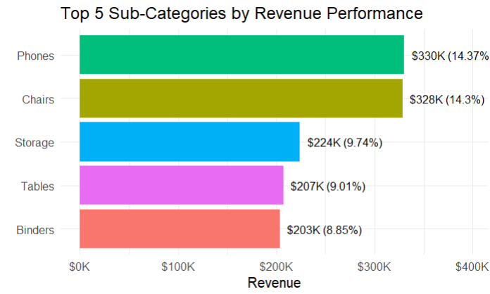

# Global Superstore Sales Analysis - R Portfolio Project

A comprehensive data analysis project demonstrating end-to-end analytics workflow using R, from data cleaning to strategic business insights.

## 📋 Table of Contents
- [Project Overview](#-project-overview)
- [Dataset](#-dataset)
- [Data Cleaning Process](#-data-cleaning-process)
- [Business Questions & Analysis](#-business-questions--analysis)
- [Key Findings](#-key-findings)
- [Technologies Used](#-technologies-used)
- [Project Structure](#-project-structure)
- [How to Run](#-how-to-run)

## 🎯 Project Overview

This project analyzes Global Superstore sales data to uncover critical business insights across multiple dimensions including revenue performance, customer segmentation, seasonal trends, geographic profitability, and discount strategy optimization. The analysis reveals actionable insights for strategic decision-making and identifies critical business issues requiring immediate attention.

## 📊 Dataset

**Source**: Global Superstore Dataset from Kaggle  
**Size**: 9,994 transactions across 21 variables  
**Time Period**: 2014-2017  
**Geographic Coverage**: United States (49 states, 4 regions)

**Key Variables**:
- Sales transactions and profit data
- Customer segments (Consumer, Corporate, Home Office)  
- Product categories (Furniture, Office Supplies, Technology)
- Geographic information (State, Region, City)
- Temporal data (Order Date, Ship Date)
- Discount and quantity information

**Files**:
- `dataset/Superstore.csv` - Raw dataset
- `dataset/Superstore_cleaned.csv` - Cleaned dataset ready for analysis

## 🧹 Data Cleaning Process

Comprehensive data cleaning was performed in [`Data wrangling.R`](Data%20wrangling.R):

### 1. **Initial Data Assessment**
```r
# Load required libraries
library(dplyr)
library(readr)
library(lubridate)
library(stringr)
library(skimr)

# Load and explore the dataset
superstore <- read_csv("dataset/Superstore.csv")
glimpse(superstore)
skim(superstore)

# Check for missing values
sapply(superstore, function(x) sum(is.na(x)))
```

**Key Findings**: 
- 9,994 rows × 21 columns
- No missing values detected
- Date columns stored as character format

### 2. **Column Name Standardization**
```r
# Remove spaces and special characters from column names
superstore <- superstore |>
  rename_all(~ gsub(" ", "_", .)) |>
  rename_all(~ gsub("-", "_", .))
```

### 3. **Date Format Conversion**
```r
# Convert Order_Date and Ship_Date from character to proper date format
superstore <- superstore |>
  mutate(
    Order_Date = parse_date_time(Order_Date, orders = c("m/d/Y")),
    Ship_Date = parse_date_time(Ship_Date, orders = c("m/d/Y"))
  )
```

### 4. **Data Quality Validation**
```r
# Check for duplicates
sum(duplicated(superstore))  # Result: 0

# Validate business logic: Ship_Date should be after Order_Date
superstore |>
  filter(Ship_Date < Order_Date) |>
  nrow()  # Result: 0

# Check for outliers in numerical columns
summary(superstore$Sales)    # Range: $0.44 to $22,638
summary(superstore$Profit)   # Range: -$6,599 to $8,399
summary(superstore$Discount) # Range: 0% to 80%
summary(superstore$Quantity) # Range: 1 to 14 items
```

**Validation Results**: 
- No duplicate records
- All ship dates occur after order dates
- 1,871 transactions (18.7%) show negative profits (business-normal)
- All discount values within acceptable range (0-80%)

## 📈 Business Questions & Analysis

All exploratory data analysis and visualizations were created in [`EDA.R`](EDA.R):

### **Question 1: Top Revenue-Generating Sub-Categories**

*"What are our top 5 best-performing product sub-categories by total sales revenue, and what percentage of our total revenue does each represent?"*

**Code:**
```r
total_sales <- sum(superstore$Sales, na.rm = T)

question1 <- superstore |>
  group_by(Sub_Category) |>
  summarise(
    Revenue = sum(Sales),
    Per_Revenue = round((sum(Sales) / total_sales) * 100, 2)
  ) |>
  slice_max(Revenue, n = 5)

# Visualization
ggplot(question1, aes(x = Revenue, y = reorder(Sub_Category, Revenue), fill = Sub_Category)) +
  geom_bar(stat = "identity") +
  labs(
    title = "Top 5 Sub-Categories by Revenue Performance",
    x = "Revenue", y = ""
  ) + 
  geom_text(aes(label = paste0("$", round(Revenue/1000, 0), "K (", Per_Revenue, "%)")),               
            hjust = -0.1, size = 3) +
  scale_x_continuous(labels = scales::dollar_format(scale = 1e-3, suffix = "K"),
                     limits = c(0, max(question1$Revenue) * 1.2)) +
  theme_minimal() + 
  guides(fill = "none")
```

**Key Insights:**
- **Phones** ($330K, 14.4%) and **Chairs** ($328K, 14.3%) are virtually tied as revenue leaders
- Top 5 sub-categories represent **56.3%** of total revenue, showing high concentration
- **Technology** (Phones, Storage) and **Furniture** (Chairs, Tables, Binders) dominate our revenue streams
- Heavy dependence on just 2 categories creates business risk but also shows clear market strengths



---

### **Question 2: Customer Segment Analysis**

*"Which customer segment generates the highest average order value, and how does their purchasing behavior differ across our three main product categories?"*

**Code:**
```r
question2 <- superstore |>
  group_by(Category, Segment) |>
  summarise(
    Count = n(),
    Average_Order_Value = mean(Sales),
    .groups = "drop"
  )

# Heatmap visualization
ggplot(question2, aes(x = Category, y = Segment, fill = Average_Order_Value)) +
  geom_tile() +
  geom_text(aes(label = paste0("$", round(Average_Order_Value, 0))), color = "white", size = 4) +
  labs(
    title = "Average Order Value Heatmap: Category vs Customer Segment",
    x = "Product Category", y = "Customer Segment",
    fill = "Avg Order Value"
  ) +
  scale_fill_gradient(low = "lightblue", high = "darkred", labels = scales::dollar_format()) +
  theme_minimal()
```

**Key Insights:**
- **Home Office** customers have the highest average order value at **$241**
- **Corporate** segment averages $234, **Consumer** segment $224
- **Technology category** shows highest values across all segments, with Home Office leading at **$536**
- **Home Office** customers are premium technology buyers, explaining their higher average order values
- **Office Supplies** remain low-value across all segments (~$115-127), indicating commodity pricing


---

### **Question 3: Seasonal Sales Trends**

*"What is our monthly sales trend over the years, and which months consistently perform best or worst for our business?"*

**Code:**
```r
superstore <- superstore |>
  mutate(
    month = month(Order_Date),
    year = year(Order_Date),
    month_name = month(Order_Date, label = TRUE)
  )

# Monthly trends analysis
monthly_trends <- superstore |>
  group_by(month_name, year) |>
  summarize(
    total_Sales = sum(Sales),
    .groups = "drop"
  )

# Time series visualization
ggplot(monthly_trends, aes(x = month_name, y = total_Sales, color = factor(year), group = year)) +
  geom_line(linewidth = 0.9) +
  geom_point() +
  labs(
    title = "Monthly Sales Trends (2014-2017)",
    subtitle = "Clear seasonal patterns with year-over-year growth",
    x = "Month", y = "Sales Revenue", color = "Year"
  ) +
  scale_color_manual(values = c("2014" = "#1f77b4", "2015" = "#ff7f0e", 
                                "2016" = "#2ca02c", "2017" = "#d62728")) +
  scale_y_continuous(labels = scales::dollar_format(scale = 1e-3, suffix = "K")) +
  theme_minimal()
```

**Key Insights:**
- **November** ($352K) and **December** ($325K) are peak performance months
- **February** ($60K) consistently shows the worst performance across all years
- **Q4 dominance**: September-December generates 43% of annual revenue
- **Strong growth trajectory**: 2017 shows significant improvement in most months
- **Predictable seasonality** enables reliable forecasting and inventory planning


---

### **Question 4: Geographic Profitability Analysis**

*"Which geographic regions and states are our top performers by profit margin, and are there any regions where we're consistently losing money?"*

**Code:**
```r
# Regional analysis
region_summary <- superstore |>
  group_by(Region) |>
  summarize(
    Total_Sales = sum(Sales),
    Total_Profit = sum(Profit),
    Profit_Margin = (sum(Profit) / sum(Sales)) * 100
  )

# State analysis - focusing on negative margin states
state_summary <- superstore |>
  group_by(State) |>
  summarize(
    Total_Sales = sum(Sales),
    Total_Profit = sum(Profit),
    Profit_Margin = (sum(Profit) / sum(Sales)) * 100
  ) |>
  filter(Profit_Margin < 0)

# Crisis states visualization
ggplot(state_summary, aes(x = Profit_Margin, y = reorder(State, Profit_Margin), 
                          fill = ifelse(Profit_Margin < -15, "Critical", "Concerning"))) +
  geom_bar(stat = "identity") +
  labs(
    title = "States with Negative Profit Margins - Crisis Areas",
    x = "Profit Margin (%)", y = ""
  ) + 
  geom_text(aes(label = paste0(round(Profit_Margin,1), "%"),
                color = ifelse(Profit_Margin < -15, "white", "black")),
            hjust = -0.1, size = 3) +
  scale_color_identity() +
  scale_fill_manual(values = c("Critical" = "darkred", "Concerning" = "darkorange")) +
  theme_minimal() + guides(fill = "none")
```

**Key Insights:**
- **10 states** are operating at negative profit margins, requiring immediate attention
- **Ohio (-21.7%)** and **Colorado (-20.3%)** show critical profitability crisis
- **Texas** shows significant concern with **-15.1%** margin despite high sales volume ($170K)
- **West** (14.9%) and **East** (13.5%) regions outperform **Central** (7.9%) region
- Geographic losses suggest operational inefficiencies, pricing issues, or excessive competition in specific markets


---

### **Question 5: Discount Strategy Optimization**

*"What is the relationship between discount levels and profitability across different product categories, and what discount strategy should we implement to maximize profits?"*

**Code:**
```r
# Create discount ranges
Discount_Range <- superstore |>
  mutate(
    Discount_Range = case_when(
      Discount == 0 ~ "No Discount",
      Discount > 0 & Discount <= 0.2 ~ "Low (1-20%)",
      Discount > 0.2 & Discount <= 0.4 ~ "Medium (21-40%)",
      Discount > 0.4 ~ "High (40%+)"
    )
  )

question5 <- Discount_Range |>
  group_by(Category, Discount_Range) |>
  summarize(
    Profit_Margin = (sum(Profit) / sum(Sales)) * 100,
    .groups = "drop"
  )

# Discount strategy heatmap
ggplot(question5, aes(x = Category, y = Discount_Range, fill = Profit_Margin)) +
  geom_tile() +
  geom_text(aes(label = paste0(round(Profit_Margin, 0), "%"), 
                color = ifelse(abs(Profit_Margin) > 20, "white", "black")), size = 4) +
  scale_color_identity() +
  labs(
    title = "Discount Strategy Crisis: High Discounts Destroying Profits",
    subtitle = "Profit margins by product category and discount level",
    x = "Product Category", y = "Discount Range", fill = "Profit Margin"
  ) +
  scale_fill_gradient2(low = "darkred", mid = "white", high = "darkgreen", 
                       midpoint = 0, name = "Profit\nMargin (%)") +
  theme_minimal()
```

**Key Insights:**
- **CRITICAL FINDING**: High discounts (40%+) are **destroying profitability** across ALL categories
- **Office Supplies** at high discount show **-119% margin** - catastrophic losses
- **No Discount** strategy yields highest margins: **22-34%** across all categories
- **Low discounts (1-20%)** remain profitable but significantly reduce margins
- **Immediate action required**: Cap all discounts at 20% maximum to preserve profitability


---

## 🎯 Key Findings

### Strategic Recommendations

1. **Revenue Optimization**
   - Focus marketing investment on Phones and Chairs (our revenue leaders)
   - Diversify revenue streams to reduce dependency on top 2 sub-categories

2. **Customer Strategy**
   - Target Home Office segment with premium technology offerings
   - Develop specialized corporate technology packages

3. **Seasonal Planning**
   - Increase inventory for Q4 peak season (Sep-Dec)
   - Implement targeted Q1 campaigns to counter February slump

4. **Geographic Expansion**
   - **URGENT**: Investigate operational issues in Ohio, Colorado, and Texas
   - Replicate West and East region success strategies in Central region

5. **Pricing Strategy**
   - **IMMEDIATE ACTION**: Eliminate discounts above 20%
   - Implement category-specific discount caps
   - Focus on value-based pricing rather than discount-driven sales

### Business Impact

- **$2.3M total revenue** analyzed across 4-year period
- **$286K total profit** with significant geographic and discount-driven losses identified


## 🛠 Technologies Used

- **R** - Primary analysis language
- **dplyr** - Data manipulation and transformation
- **ggplot2** - Data visualization and charts
- **lubridate** - Date and time handling
- **readr** - Data import/export
- **scales** - Chart formatting and scaling

## 📁 Project Structure

```
Global-Superstore-Analysis/
├── dataset/
│   ├── Superstore.csv              # Raw dataset
│   └── Superstore_cleaned.csv      # Cleaned dataset
├── images/
│   ├── question1.png               # Revenue analysis chart
│   ├── question2.png               # Customer segment heatmap
│   ├── question3.png               # Seasonal trends line chart
│   ├── question4.png               # Geographic profitability chart
│   └── question5.png               # Discount strategy heatmap
├── Data wrangling.R                # Data cleaning and preprocessing
├── EDA.R                          # Exploratory data analysis and visualizations
└── README.md                      # Project documentation
```

## 🚀 How to Run


1. **Run the analysis**
   ```r
   # Step 1: Data cleaning
   source("Data wrangling.R")
   
   # Step 2: Exploratory analysis and visualizations
   source("EDA.R")
   ```

2. **View outputs**
   - Cleaned dataset: `dataset/Superstore_cleaned.csv`
   - Visualizations: `images/` folder
   - Analysis results: Console output from EDA.R

---

**Author**: Eng.Omar  
**Contact me**: [LinkedIn](www.linkedin.com/in/codewithzaki)
**Date**: August 2025  
**Portfolio Project**: R for Data Analytics
