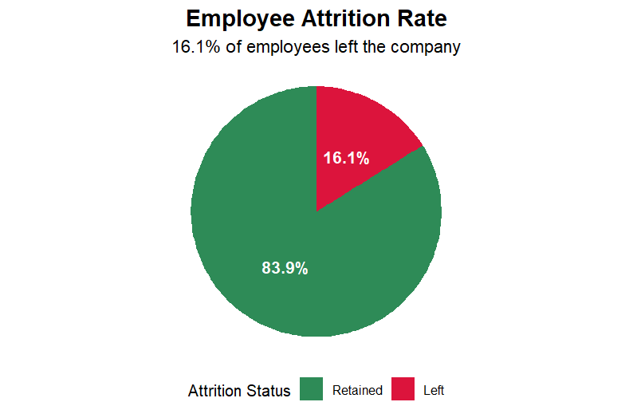
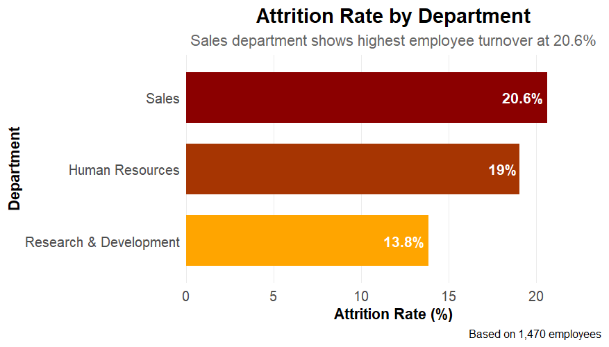
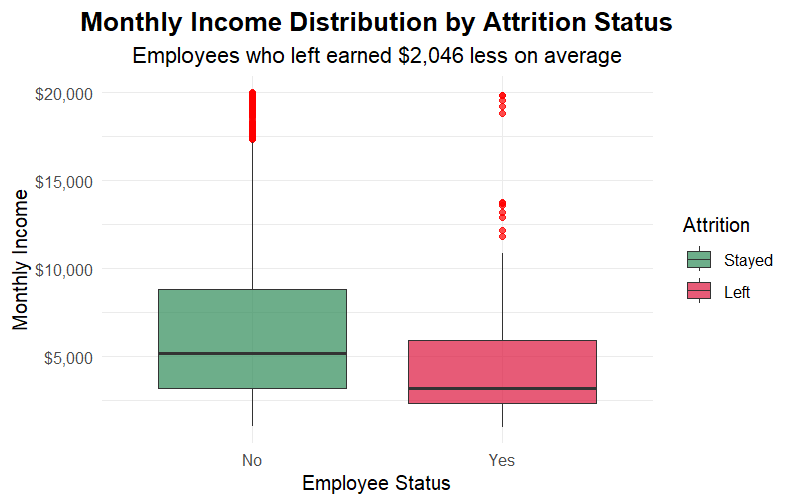
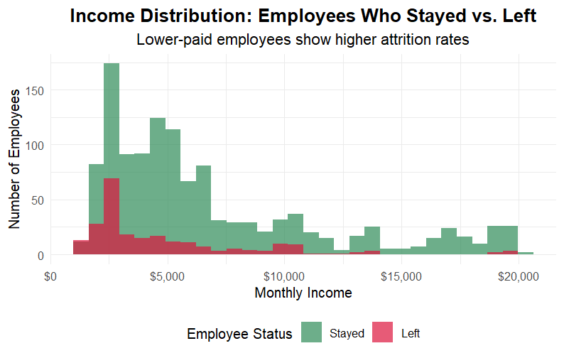
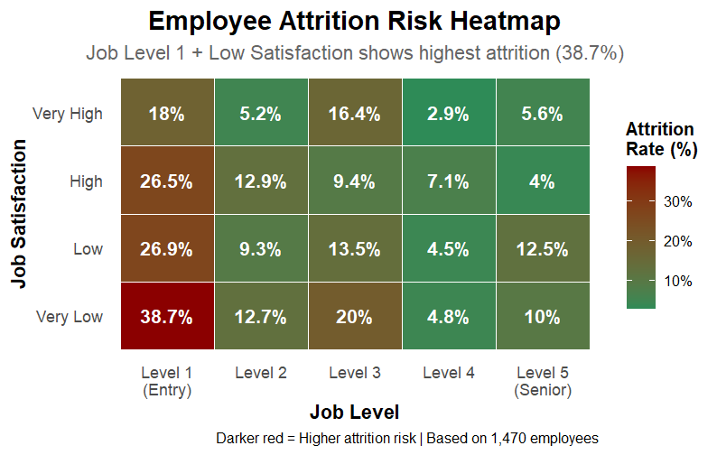

# HR Analytics: Employee Attrition Analysis

## 📊 Project Overview

This project analyzes employee attrition patterns using the IBM HR Analytics dataset to identify key factors contributing to employee turnover. Through comprehensive data analysis and visualization in R, we uncover actionable insights to help organizations improve employee retention strategies.

## 🎯 Business Objectives

- Understand overall company attrition patterns
- Identify departments with highest turnover risks
- Analyze the relationship between compensation and employee retention
- Evaluate the impact of overtime work on attrition
- Examine how job satisfaction and job level combinations affect turnover

## 📁 Project Structure

```
Project 3/
├── data/
│   └── HR-Employee.csv              # Raw dataset
├── Data wrangling.R                 # Data cleaning and preprocessing
├── EDA.R                           # Exploratory data analysis and visualizations
├── images/                         # Generated visualizations
│   ├── project3question1.png
│   ├── project3question2.png
│   ├── project3question3_histogram.png | project3question3_boxplot.png
│   ├── project3question4.png
│   └── project3question5.png
└── README.md                       # Project documentation
```

## 🔧 Technologies Used

- **R** - Primary analysis language
- **dplyr** - Data manipulation
- **ggplot2** - Data visualization
- **readr** - Data import
- **skimr** - Data exploration
- **scales** - Chart formatting

## 📋 Dataset Information

- **Source**: IBM HR Analytics Employee Attrition & Performance
- **Size**: 1,470 employees with 35 variables
- **Key Variables**: Attrition, Department, MonthlyIncome, OverTime, JobSatisfaction, JobLevel, and more
- **Target Variable**: Attrition (Yes/No)

## 🧹 Data Cleaning & Preprocessing

### Initial Data Exploration
```r
# Load and explore the dataset
hr_data <- read_csv("data/HR-Employee.csv")
glimpse(hr_data)
str(hr_data)
skim(hr_data)
```

### Data Transformations Applied

1. **Categorical Variables Conversion**
   - Converted character variables to factors: `Attrition`, `BusinessTravel`, `Department`, `EducationField`, `Gender`, `JobRole`, `MaritalStatus`, `OverTime`

2. **Ordinal Variables Conversion**
   - Converted numeric rating scales to ordered factors: `Education`, `EnvironmentSatisfaction`, `JobInvolvement`, `JobLevel`, `JobSatisfaction`, `PerformanceRating`, `RelationshipSatisfaction`, `StockOptionLevel`, `WorkLifeBalance`

3. **Unnecessary Columns Removal**
   - Removed constant value columns: `EmployeeCount`, `Over18`, `StandardHours`
   - Removed identifier column: `EmployeeNumber`

## 📈 Business Analysis & Key Findings

### Question 1: What is the overall attrition rate in the company?

**Code:**
```r
question1 <- hr_data %>%
  count(Attrition) %>%
  mutate(Percentage = n / sum(n) * 100)
```

**Key Insights:**
- **Overall attrition rate: 16.1%** (237 out of 1,470 employees left)
- **Retention rate: 83.9%** (1,233 employees stayed)
- The attrition rate is slightly above typical industry benchmarks (10-15%), indicating room for improvement



---

### Question 2: Which department has the highest attrition rate?

**Code:**
```r
question2 <- hr_data %>%
  group_by(Department) %>%
  summarise(
    Total = n(),
    Left = sum(Attrition == "Yes"), 
    Percentage = (Left / Total) * 100,
    .groups = "drop"
  )
```

**Key Insights:**
- **Sales Department leads with 20.6% attrition** (92 out of 446 employees)
- **Human Resources follows at 19.0%** (12 out of 63 employees)
- **Research & Development has the lowest at 13.8%** (133 out of 961 employees)
- **7-point gap** between highest and lowest departments suggests inconsistent retention practices



---

### Question 3: How does monthly income relate to attrition?

**Code:**
```r
question3 <- hr_data %>%
  group_by(Attrition) %>%
  summarize(
    average = mean(MonthlyIncome),
    median = median(MonthlyIncome),
    min_salary = min(MonthlyIncome),
    max_salary = max(MonthlyIncome)
  )
```

**Key Insights:**
- **Significant salary gap: $2,046 difference** in average income
  - Employees who left: $4,787 average
  - Employees who stayed: $6,833 average
- **Median difference even larger: $2,002**
- **Lower compensation strongly correlates with higher attrition**
- Clear evidence that competitive salaries are crucial for retention



---

### Question 4: Does overtime work correlate with attrition?

**Code:**
```r
question4 <- hr_data %>%
  group_by(OverTime) %>%
  summarise(
    Total = n(),
    Left = sum(Attrition == "Yes"), 
    Percentage = (Left / Total) * 100,
    .groups = "drop"
  )
```

**Key Insights:**
- **Dramatic overtime impact: 30.5% vs 10.4% attrition rate**
- **Overtime workers are 3x more likely to leave** the company
- **127 out of 237 total leavers (53.6%) work overtime** despite being only 28% of workforce
- **Clear burnout pattern** - strongest predictor of attrition identified
- Urgent need to review overtime policies and workload distribution


---

### Question 5: How do job satisfaction and job level combinations affect attrition?

**Code:**
```r
question5 <- hr_data %>%
  group_by(JobSatisfaction, JobLevel) %>%
  summarise(
    Total = n(),
    Left = sum(Attrition == "Yes"), 
    Percentage = (Left / Total) * 100,
    .groups = "drop"
  )
```

**Key Insights:**
- **Highest risk combination: Entry-level + Very Low Satisfaction = 38.7% attrition**
- **Job Level 1 dominates risk** across all satisfaction levels (18-38.7% attrition)
- **Senior levels remain stable** (Levels 4-5 have consistently low attrition)
- **Satisfaction impact varies by level** - matters most for entry-level positions
- **Priority intervention needed** for entry-level employee engagement



## 🎯 Strategic Recommendations

### 1. **Address Overtime Crisis**
- **Immediate action required** - 30.5% attrition for overtime workers
- Implement workload redistribution and staffing adjustments
- Consider overtime compensation review

### 2. **Salary Competitiveness Review**
- **$2,046 average gap** indicates compensation issues
- Conduct market salary benchmarking
- Priority focus on lower-paid positions

### 3. **Department-Specific Interventions**
- **Sales department requires urgent attention** (20.6% attrition)
- Investigate sales culture, targets, and support systems
- **HR department review** - concerning for retention experts

### 4. **Entry-Level Employee Support**
- **Critical focus on Job Level 1** employees
- Enhance onboarding and mentorship programs
- Regular satisfaction check-ins for new hires

### 5. **Work-Life Balance Initiatives**
- Strong correlation between overtime and turnover
- Implement flexible working arrangements
- Monitor and limit excessive overtime

## 📊 Technical Implementation

### Visualization Techniques Used
- **Pie Chart** - Overall attrition overview
- **Horizontal Bar Chart** - Department comparison
- **Box Plot & Histogram** - Income distribution analysis
- **Bar Chart** - Overtime impact comparison
- **Heatmap** - Multi-dimensional risk analysis

### Data Quality Measures
- Comprehensive data type conversions
- Removal of non-informative variables
- Proper factor level ordering for ordinal data
- Maintained data integrity throughout analysis

## 🔍 Key Metrics Summary

| Metric | Value | Impact Level |
|--------|-------|--------------|
| Overall Attrition Rate | 16.1% | Moderate-High |
| Highest Dept. Attrition | 20.6% (Sales) | High |
| Income Gap (Leavers vs Stayers) | $2,046 | High |
| Overtime Attrition Multiplier | 3x Higher | Critical |
| Highest Risk Combination | 38.7% (L1 + Low Satisfaction) | Critical |

## 💡 Business Impact

This analysis provides actionable insights that can help reduce turnover by:
- **Identifying high-risk employee segments** for targeted retention efforts
- **Quantifying the financial impact** of key retention factors
- **Prioritizing intervention strategies** based on data-driven evidence
- **Establishing benchmarks** for ongoing HR performance monitoring

## 🚀 Future Enhancements

- Predictive modeling for attrition risk scoring
- Cost-benefit analysis of retention interventions
- Longitudinal analysis of retention program effectiveness
- Integration with real-time HR metrics dashboards

---

**Project completed as part of R for Data Analytics portfolio development**

**Author**: Eng.Omar
**Contact me**: [LinkedIn](www.linkedin.com/in/codewithzaki)  
**Date**: August 2025  
**Tools**: R, RStudio, ggplot2, dplyr