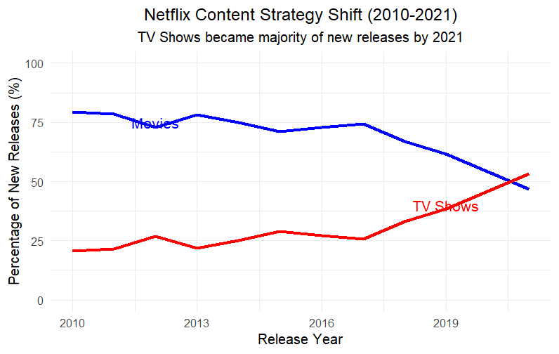
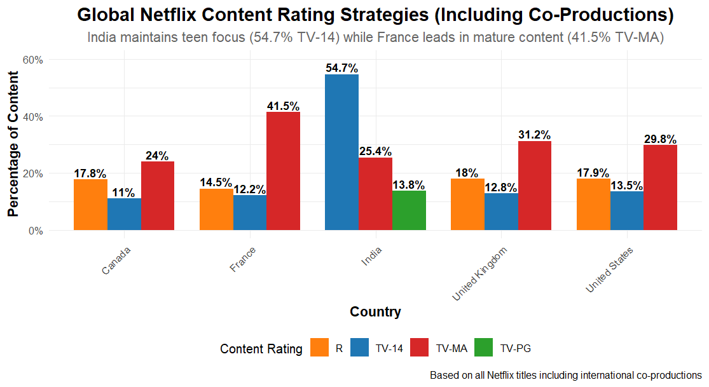
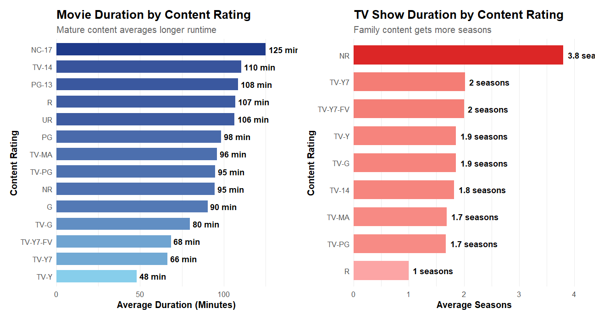
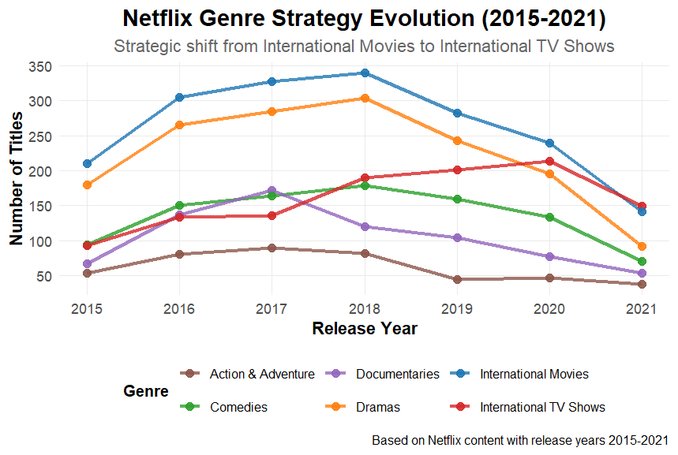
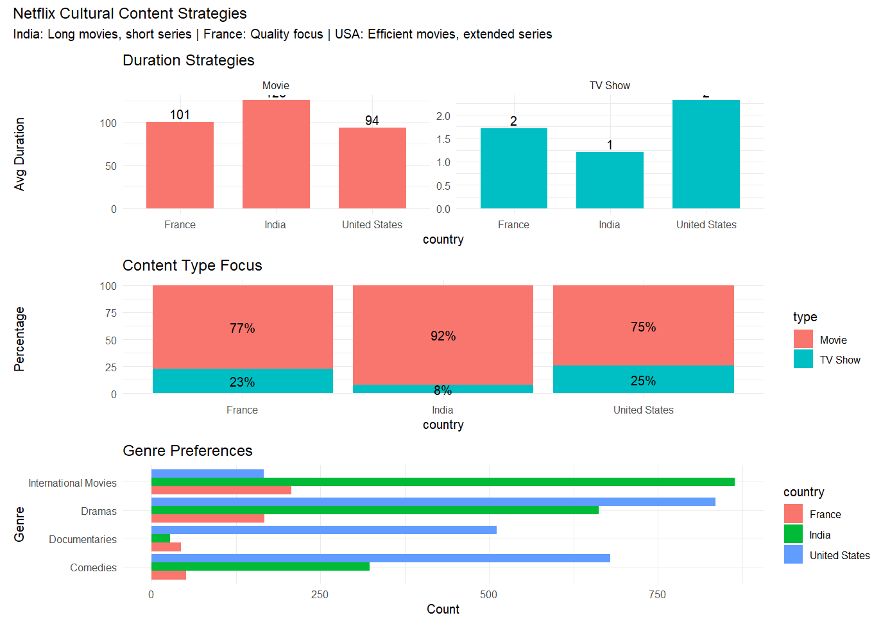

# Netflix Content Analytics: Global Strategy & Cultural Insights

## 📊 Project Overview

This project provides a comprehensive analysis of Netflix's global content strategy using the Netflix Movies and TV Shows dataset. Through advanced data analysis and visualization in R, we uncover strategic insights about content evolution, cultural preferences, geographic distribution patterns, and Netflix's adaptation to global markets.

## 🎯 Business Objectives

- Analyze Netflix's strategic evolution from movie-focused to series-first platform
- Investigate global content rating strategies and cultural preferences
- Examine the correlation between content characteristics and audience targeting
- Track genre popularity trends and strategic content pivots
- Develop cultural content profiles for major content-producing countries

## 📁 Project Structure

```
Project 4/
├── data/
│   ├── netflix_titles.csv              # Raw dataset (8,807 titles)
│   └── netflix_titles_cleaned.csv      # Processed dataset
├── Data wrangling.R                     # Data cleaning and preprocessing
├── EDA.R                               # Exploratory data analysis and visualizations
├── images/                             # Generated visualizations
│   ├── project4question1.png
│   ├── project4question2.png
│   ├── project4question3_multi.png
│   ├── project4question4.png
│   └── project4question5.png
└── README.md                           # Project documentation
```

## 🔧 Technologies Used

- **R** - Primary analysis language
- **dplyr** - Data manipulation and transformation
- **ggplot2** - Advanced data visualization
- **tidyr** - Data reshaping and cleaning
- **lubridate** - Date/time manipulation
- **stringr** - Text processing
- **patchwork** - Chart composition
- **scales** - Chart formatting

## 📋 Dataset Information

- **Source**: Netflix Movies and TV Shows Dataset (Kaggle)
- **Size**: 8,807 titles with 12 variables
- **Time Period**: 1925-2021 (focus on 2010-2021 for trends)
- **Geographic Coverage**: 73+ countries
- **Content Types**: Movies and TV Shows
- **Key Variables**: Type, Title, Director, Cast, Country, Date Added, Release Year, Rating, Duration, Genres

## 🧹 Data Cleaning & Preprocessing

### Initial Data Exploration
```r
# Load and explore the dataset
netflix <- read_csv("data/netflix_titles.csv")
glimpse(netflix)
skim(netflix)
```

### Major Data Quality Issues Addressed

1. **Missing Value Handling**
   - **Directors**: 30% missing in TV Shows (normal pattern) - replaced with "Multiple Directors"
   - **Cast**: 9% missing across content types - replaced with "Not Available"
   - **Countries**: 9% missing values handled appropriately

2. **Date Format Conversion**
   ```r
   netflix <- netflix %>%
     mutate(date_added = mdy(date_added))
   ```

3. **Duration Field Processing**
   ```r
   netflix <- netflix %>%
     separate(duration, into = c("duration_value", "duration_unit"), sep = " ") %>%
     mutate(duration_value = as.numeric(duration_value))
   ```

4. **Multi-Value Field Expansion**
   ```r
   # Handle multi-country titles
   netflix_countries_expanded <- netflix %>%
     filter(!is.na(country)) %>%
     separate_rows(country, sep = ", ") %>%
     mutate(country = str_trim(country))
   
   # Handle multi-genre titles  
   netflix_genre_expanded <- netflix %>%
     filter(!is.na(listed_in)) %>%
     separate_rows(listed_in, sep = ", ") %>%
     mutate(listed_in = str_trim(listed_in))
   ```

5. **Data Type Optimization**
   ```r
   netflix <- netflix %>%
     mutate(
       type = as.factor(type),
       rating = as.factor(rating),
       duration_unit = as.factor(duration_unit)
     )
   ```

## 📈 Business Analysis & Key Findings

### Question 1: How has Netflix's content strategy evolved from Movies to TV Shows?

**Code:**
```r
question1 <- netflix %>%
  filter(release_year >= 2010) %>%
  group_by(release_year) %>%
  summarise(
    total = n(),
    movies = sum(type == "Movie") / n() * 100,
    shows = sum(type == "TV Show") / n() * 100
  )
```

**Key Insights:**
- **Strategic pivot point**: 2018-2020 marked Netflix's transition from movie-dominant (79% in 2010) to series-first strategy (53% TV Shows by 2021)
- **Inflection point**: 2020 was the crossover year when TV Shows became the majority of new releases
- **Business rationale**: Shift reflects binge-watching culture, subscriber retention strategy, and original content focus
- **Competitive response**: Strategic adaptation to streaming wars and content differentiation needs



---

### Question 2: How do global content rating strategies vary by country?

**Code:**
```r
# Multi-country analysis including co-productions
netflix_countries_expanded <- netflix %>%
  filter(!is.na(country)) %>%
  separate_rows(country, sep = ", ") %>%
  mutate(country = str_trim(country))

question2_multi <- netflix_countries_expanded %>%
  filter(country %in% c("United States", "India", "France", "Canada", "United Kingdom")) %>%
  group_by(country, rating) %>%
  summarise(count = n(), .groups = "drop") %>%
  group_by(country) %>%
  mutate(
    total_country = sum(count),
    percentage = (count / total_country) * 100
  ) %>%
  slice_max(n = 3, order_by = percentage)
```

**Key Insights:**
- **India maintains teen focus**: 54.7% TV-14 content, reflecting family-oriented Bollywood influence
- **France leads in mature content**: 41.5% TV-MA, emphasizing sophisticated European cinema traditions  
- **United States shows balanced approach**: 29.8% TV-MA when including international collaborations
- **Cultural content strategies**: Clear evidence of localized content approaches based on cultural preferences
- **Co-production impact**: Including international collaborations reveals more nuanced global content strategies



---

### Question 3: How do content ratings correlate with duration patterns?

**Code:**
```r
# Movies duration analysis
question3_movie_clean <- netflix %>%
  filter(type == "Movie", !is.na(rating)) %>%
  filter(!rating %in% c("66 min", "74 min", "84 min")) %>%
  group_by(rating) %>%
  summarise(average = mean(duration_value, na.rm = TRUE))

# TV Shows season analysis  
question3_tv_clean <- netflix %>%
  filter(type == "TV Show", !is.na(rating)) %>%
  group_by(rating) %>%
  summarise(average = mean(duration_value, na.rm = TRUE))
```

**Key Insights:**
- **Movies**: Clear correlation between maturity and length - NC-17 (125 min) → TV-Y (48 min)
- **Mature content requires longer storytelling**: Adult themes need more complex narrative development
- **Family content optimized for shorter attention spans**: Children's content averages under 70 minutes
- **TV Shows show inverse pattern**: Family content gets MORE seasons (NR: 3.8 seasons vs TV-MA: 1.7 seasons)
- **Strategic insight**: Netflix uses different engagement strategies - complex narratives for adult movies, sustained series for family audiences



---

### Question 4: What are the trending genre patterns and strategic shifts?

**Code:**
```r
# Genre expansion and trend analysis
netflix_genre_expanded <- netflix %>%
  filter(!is.na(listed_in)) %>%
  separate_rows(listed_in, sep = ", ") %>%
  mutate(listed_in = str_trim(listed_in))

top_genres <- c("International Movies", "Dramas", "Comedies", 
                "International TV Shows", "Documentaries", "Action & Adventure")

question4 <- netflix_genre_expanded %>%
  filter(release_year >= 2015, listed_in %in% top_genres) %>%
  group_by(release_year, listed_in) %>%
  summarise(count = n(), .groups = "drop")
```

**Key Insights:**
- **International Movies**: Peaked in 2018 (340 titles) then declined - reflects licensing to original content shift
- **International TV Shows**: Steady growth from 93 → 149 titles (2015-2021) - strategic series focus
- **Documentary boom and bust**: Peak 2016-2017 (172 titles) followed by sharp decline to 53 titles by 2021
- **Consistent drama leadership**: Universal appeal maintained across all years (180-304 title range)
- **Strategic evolution**: Clear pivot from international movie acquisition to original series production



---

### Question 5: What cultural content profiles emerge from comprehensive analysis?

**Code:**
```r
# Multi-dimensional cultural analysis
netflix_genre_country_expanded <- netflix_countries_expanded %>%
  filter(!is.na(listed_in)) %>%
  separate_rows(listed_in, sep = ", ") %>%
  mutate(listed_in = str_trim(listed_in))

# Duration strategies by country
cultural_duration <- netflix_countries_expanded %>%
  filter(country %in% c("United States", "India", "France")) %>%
  group_by(country, type) %>%
  summarise(
    count = n(),
    avg_duration = mean(duration_value, na.rm = TRUE),
    .groups = "drop"
  )

# Genre preferences by country
cultural_genres <- netflix_genre_country_expanded %>%
  filter(country %in% c("United States", "India", "France")) %>%
  group_by(country, listed_in) %>%
  summarise(count = n(), .groups = "drop") %>%
  group_by(country) %>%
  slice_max(n = 5, order_by = count)
```

**Cultural Content Profiles:**

**🇮🇳 India - Bollywood Entertainment Hub:**
- **Duration Strategy**: Long movies (126 min), short series (1.2 seasons)
- **Content Focus**: 92% movies, 8% TV shows - heavily movie-dominated
- **Genre Preferences**: International Movies (864), Dramas (662), Comedies (323)
- **Rating Strategy**: Teen-focused (54.7% TV-14) - family-oriented approach
- **Cultural Insight**: Reflects Bollywood's elaborate storytelling tradition and family entertainment focus

**🇫🇷 France - Arthouse Quality Focus:**
- **Duration Strategy**: Standard movies (101 min), limited series (1.7 seasons)  
- **Content Focus**: 77% movies, 23% TV shows - cinema-centric culture
- **Genre Preferences**: International Movies (207), Dramas (167), Independent Movies (73)
- **Rating Strategy**: Mature content leader (41.5% TV-MA) - sophisticated audience
- **Cultural Insight**: European arthouse cinema tradition with quality-over-quantity approach

**🇺🇸 United States - Diverse Content Factory:**
- **Duration Strategy**: Efficient movies (94 min), extended series (2.3 seasons)
- **Content Focus**: 75% movies, 25% TV shows - balanced portfolio approach
- **Genre Preferences**: Dramas (835), Comedies (680), Documentaries (511)
- **Rating Strategy**: Balanced mature focus (29.8% TV-MA) - diverse demographics
- **Cultural Insight**: Commercial efficiency meets binge-culture with most diverse content strategy



## 🎯 Strategic Recommendations

### 1. **Content Strategy Evolution**
- **Continue series-first approach**: TV Shows now represent majority of new releases
- **Maintain movie portfolio**: Efficient 90-95 minute movies for specific demographics
- **Balance global vs local**: Strategic mix of international and regional content

### 2. **Cultural Localization Strategy**
- **India**: Continue teen-focused, extended movie experiences (Bollywood model)
- **France**: Maintain arthouse quality, mature content positioning
- **USA**: Leverage diverse portfolio strength, optimize for binge-watching culture

### 3. **Genre Portfolio Optimization**
- **Reduce International Movie dependency**: Successfully transitioning from peak dependency
- **Expand International TV Shows**: Growth trend supports series-first strategy
- **Strategic Documentary positioning**: More targeted approach after 2017 peak

### 4. **Duration Optimization**
- **Movies**: Maintain rating-duration correlation for targeted demographics
- **TV Shows**: Family content strategy with multiple seasons proving successful
- **Cultural adaptation**: Respect local viewing preferences and attention patterns

### 5. **Rating Strategy by Market**
- **Maintain cultural authenticity**: Local rating preferences reflect cultural values
- **Teen content focus**: India model showing strong engagement
- **Mature content markets**: France and European markets for sophisticated content

## 📊 Technical Implementation

### Advanced Data Processing Techniques
- **Multi-value field handling**: Comprehensive expansion of comma-separated values
- **Missing value strategies**: Context-aware imputation based on content type patterns
- **Date/time processing**: Robust handling of various date formats
- **Text processing**: Advanced string manipulation for international content

### Visualization Approaches
- **Multi-panel dashboards**: Comprehensive cultural comparison layouts
- **Time series analysis**: Trend identification with strategic inflection points
- **Geographic analysis**: Country-based content strategy visualization
- **Correlation analysis**: Rating-duration relationship mapping

### Statistical Insights
- **Trend analysis**: Year-over-year strategic evolution tracking
- **Cultural profiling**: Multi-dimensional country characterization
- **Strategic pivot identification**: Data-driven inflection point detection

## 🔍 Key Metrics Summary

| Dimension | Baseline (2010) | Current (2021) | Strategic Shift |
|-----------|----------------|----------------|-----------------|
| Content Type Split | 79% Movies, 21% TV | 47% Movies, 53% TV | Series-First Strategy |
| Top Genre (International Movies) | Growing | Peak 2018, Declining | Licensing → Original |
| Geographic Focus | US-Centric | Global (73+ countries) | International Expansion |
| Cultural Strategies | Standardized | Localized by Country | Cultural Adaptation |
| Duration Strategy | Standard | Rating-Optimized | Demographic Targeting |

## 💡 Business Impact & Future Opportunities

### Quantified Insights Delivered
- **Strategic Timeline**: Clear identification of 2018-2020 pivot period
- **Cultural Intelligence**: Comprehensive profiles for major content markets
- **Genre Evolution**: Data-driven understanding of content strategy shifts
- **Duration Optimization**: Rating-based content length strategies

### Future Enhancement Opportunities
- **Predictive Modeling**: Content success prediction based on cultural profiles
- **Real-time Monitoring**: Geographic content performance tracking
- **Competitive Analysis**: Cross-platform content strategy comparison
- **ROI Optimization**: Content investment allocation by cultural market

## 🚀 Technical Skills Demonstrated

- **Advanced R Programming**: Complex data manipulation and analysis workflows
- **Data Visualization Mastery**: Multi-panel dashboard creation and storytelling
- **Business Intelligence**: Strategic insight extraction from complex datasets
- **Cultural Analytics**: Cross-cultural pattern recognition and profiling
- **Time Series Analysis**: Trend identification and strategic pivot detection
- **Text Processing**: Advanced string manipulation and multi-value field handling

---

**Project completed as part of R for Data Analytics portfolio development**

**Author**: Eng.Omar  
**Contact**: [LinkedIn](https://www.linkedin.com/in/codewithzaki)  
**Date**: August 2025  
**Tools**: R, RStudio, ggplot2, dplyr, tidyr, patchwork, lubridate

